# Khushal Singh Sankhla

<!-- GITHUB-ASSETS-START -->

<table>
<tr>
<td width="250" align="center" valign="top"></td>
<td width="650" align="center" valign="top"></td>
</tr>
</table>

  

<!-- GITHUB-ASSETS-END -->

---

## 🚀 About Me

I am a **Master of Computer Applications (MCA)** student at **JECRC University** with hands-on experience in **Data Analysis**, **Business Intelligence (BI)**, and **Full-Stack AI development**. 

* **🎯 Career Goal:** Seeking professional roles in **Data Analytics**, **Business Intelligence**, **SQL Development**, or **Data Engineering**.
* **💡 Philosophy:** Leveraging advanced BI tools and modern AI-assisted engineering to translate complex datasets into actionable, high-impact business insights.
* **📍 Location:** Jodhpur, Rajasthan, India

---

## 🛠️ Technical Toolbox

<table>
  <tr>
    <td valign="top" width="50%">
      <h3>📊 Business Intelligence & Analytics</h3>
      <ul>
        <li><b>BI Tools:</b> Microsoft Power BI, Microsoft Fabric</li>
        <li><b>Languages:</b> DAX (Data Analysis Expressions), Power Query M</li>
        <li><b>Data Modeling:</b> Star Schema, Snowflake Schema, KPI Dashboard Development</li>
        <li><b>Analytics:</b> EDA (Exploratory Data Analysis), ETL Pipelines, Data Cleaning, Data Transformation</li>
      </ul>
    </td>
    <td valign="top" width="50%">
      <h3>💻 Programming & Databases</h3>
      <ul>
        <li><b>Languages:</b> Python, SQL (PostgreSQL, MySQL), JavaScript, Java, C++</li>
        <li><b>Libraries:</b> Pandas, NumPy, Matplotlib, Seaborn, SQLAlchemy</li>
        <li><b>Databases:</b> PostgreSQL, MySQL, MongoDB</li>
        <li><b>Tools & Platforms:</b> Git, GitHub, VS Code, pgAdmin, Vercel, Render</li>
      </ul>
    </td>
  </tr>
</table>

---

## 📂 Featured Projects

### 🌟 Velora AI — AI Website Builder
> *React 19, Node.js, Express 5, MongoDB, DeepSeek, Gemini 2.5 Pro, Razorpay, Firebase*
* Developed a full-stack MERN application where users describe a website in plain English and receive a multi-file, responsive website.
* Utilized a **DeepSeek and Gemini 2.5 Pro** dual-model pipeline via OpenRouter API with JSON validation and auto-retry on failure.
* Integrated Razorpay payments (HMAC verification), Firebase OAuth, JWT cookie authentication, credit system, Monaco live preview, and an AI diff editor with undo/ZIP export.

### 📦 Samsung Supply Chain and Logistics Dashboard
> *Microsoft Power BI, DAX, Star Schema, Power Query M*
* Designed a star schema data model with **4 fact tables** and **6 dimension tables** covering procurement, production, inventory, logistics, and sales.
* Wrote **18+ DAX measures** including YoY and MoM time-intelligence calculations.
* Built drill-down KPI scorecards tracking supplier delivery rates, shipment status, and production efficiency across 5 business functions.

### 🎵 Spotify Top 50 Analytics Dashboard
> *Microsoft Power BI, DAX, Power Query M*
* Built a 4-page Power BI dashboard analyzing 789 songs and 342 artists from the Spotify Top 50 dataset.
* Wrote DAX measures for average popularity (90) and average duration (3.28 min).
* Discovered actionable insights (e.g., Singles score 92 vs Albums at 88, and 2024 catalog grew 6.9% YoY).

### 🍔 Swiggy vs Zomato SQL Competitive Analysis
> *PostgreSQL, Microsoft Power BI, Advanced SQL*
* Wrote **18+ PostgreSQL queries** using CTEs, window functions (`RANK`, `DENSE_RANK`, `LAG`, `LEAD`), and subqueries to compare restaurant ratings, delivery times, and revenue across **10+ cities**.
* Visualized findings in Power BI with brand comparison charts and cuisine-level breakdowns.

---

## 🎓 Education

* **🎓 Master of Computer Applications (MCA)**
  * *JECRC University, Jaipur* | Aug 2025 – Aug 2027
  * **CGPA:** `8.65 / 10`
* **🎓 Bachelor of Computer Applications (BCA)**
  * *Jai Narain Vyas University, Jodhpur* | Jul 2022 – Jul 2025
  * **Aggregate:** `72.53%`

---

## 🏆 Certifications

* 🎓 **Manage and Secure Power BI** — *Microsoft Learn*
* 🎓 **Manage a Microsoft Fabric Environment** — *Microsoft Learn*
* 🎓 **Implement Real-Time Intelligence with Microsoft Fabric** — *Microsoft Learn*
* 🎓 **Data Analytics Essentials** — *Cisco Networking Academy*

---

## 📧 Let's Connect!

* **💼 LinkedIn:** [linkedin.com/in/khushal-singh-sankhla](https://linkedin.com/in/khushal-singh-sankhla)
* **✉️ Email:** [khushalsinghsankhla203@gmail.com](mailto:khushalsinghsankhla203@gmail.com)
* **🌐 GitHub:** [github.com/khushalsinghsankhla2808](https://github.com/khushalsinghsankhla2808)

---
> Generated by the KHUSHAL SINGH SANKHLA
